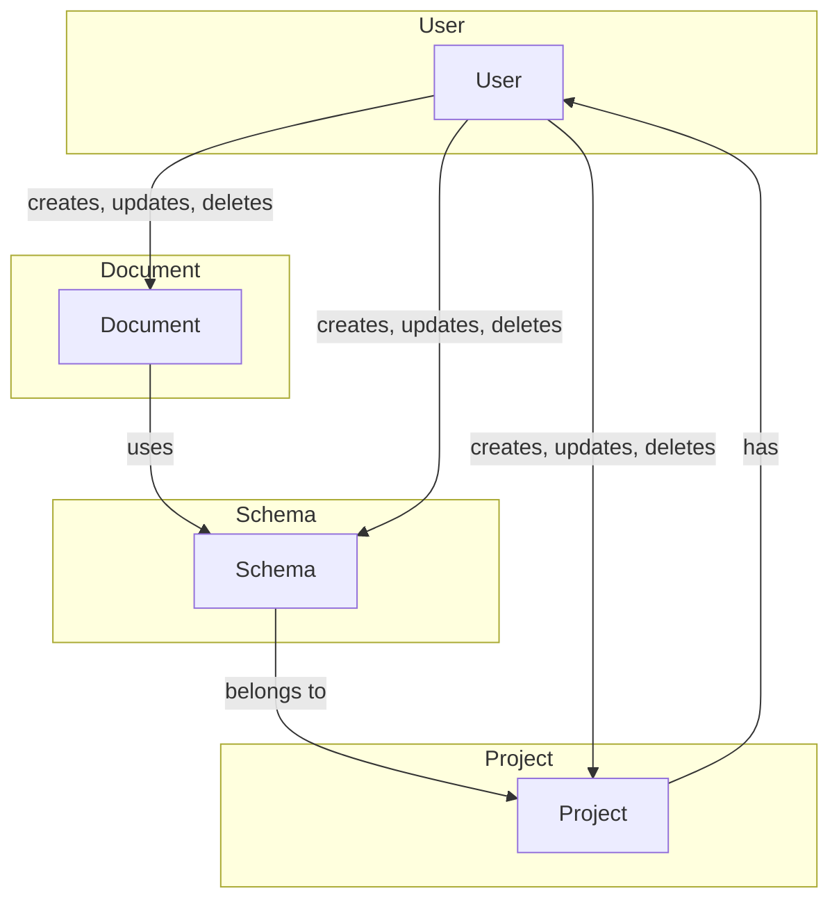

<!-- TABLE OF CONTENTS -->
<details>
  <summary>Table of Contents</summary>
  <ol>
    <li>
      <a href="#about-the-project">About The Project</a>
      <ul>
        <li><a href="#built-with">Built With</a></li>
        <li><a href="#system-specification">System Specification</a></li>
        <li><a href="#dataset">Dataset</a></li>
      </ul>
    </li>
    <li>
      <a href="#getting-started">Getting Started</a>
      <ul>
        <li><a href="#prerequisites">Prerequisites</a></li>
        <li><a href="#installation">Installation</a></li>
      </ul>
    </li>
  </ol>
</details>

<!-- ABOUT THE PROJECT -->

## About The Project

### Built With

This section lists the major frameworks/libraries used to bootstrap the project. The following technologies were utilized

[![Node][Node.js]][Node-url]
[![Node][Express.js]][Express-url]
[![Node][MongoDB]][MongoDB-url]

<!-- METHODOLOGY -->

## Methodology

I chose to develop the server first, using TypeScript (ts), before creating the OpenAPI specification. There are several reasons behind this approach:

1. Speed of development: By starting with the server, I was able to get off to a faster start in setting up my application's business logic. This enabled rapid iteration on the code.

2. Understanding of real needs: By developing the server first, I was able to gain a better understanding of the application's real needs. This facilitated the creation of a more precise OpenAPI specification, better adapted to the application's actual functionalities.

3. Managing technical constraints: Starting with development, I encountered technical challenges that may not have been obvious when writing the specification. This enabled me to adjust the specification according to the real constraints and opportunities encountered during implementation.

<!-- SYSTEM SPECIFICATION -->

## System Specification

This type of CMS is unique in that it focuses on content management without an integrated front-end, allowing developers to manipulate data consistently through operations such as creation, retrieval, update, and deletion.

The system comprises several core entities:

1. User: Represents individuals using the system, with properties such as name and email address.

2. Project: Corresponds to a logical grouping of schemas and documents, with properties including the project name and the associated user's ID.

3. Schema: Defines the structure of a document and includes properties such as name, title, a list of fields, and the ID of the associated project.

4. Document: An instance of content based on a specific schema, characterized by a name, a list of fields, and the ID of the associated schema.

The main operations of the system include user, project, schema, and document management. For instance, developers can perform actions such as retrieving the list of users, creating a new project, updating an existing schema, or deleting a document.

The system employs middlewares, including a "logger" that records each request in an access file, providing traceability for actions taken.

System configuration involves using a MongoDB database to store data, with environment variables configured through a .env file, allowing flexible management of parameters such as the port and the database URL.



<!-- DATASET -->

## Dataset

### Users

| \_id                     | name        | email                   |
| ------------------------ | ----------- | ----------------------- |
| 657b73f2cba395eef6d5288a | John Doe    | john.doe@example.com    |
| 657b7405cba395eef6d5288c | Jane Smith  | jane.smith@example.com  |
| 657b7411cba395eef6d5288e | Bob Johnson | bob.johnson@example.com |

### Projects

| \_id                     | name           | title            | user                     | website                                    |
| ------------------------ | -------------- | ---------------- | ------------------------ | ------------------------------------------ |
| 657b7498cba395eef6d52891 | johnsWebApp    | John's Web App   | 657b73f2cba395eef6d5288a | [https://example.org](https://example.org) |
| 657b74c4cba395eef6d52895 | janesPortfolio | Jane's Portfolio | 657b7405cba395eef6d5288c | [https://example.org](https://example.org) |
| 657b74d8cba395eef6d52897 | bobsBlog       | Bob's Blog       | 657b7411cba395eef6d5288e | [https://example.org](https://example.org) |

### Schemas

| \_id                     | name            | title            | fields                                                                                    | project                  |
| ------------------------ | --------------- | ---------------- | ----------------------------------------------------------------------------------------- | ------------------------ |
| 657b75aacba395eef6d5289c | WebAppSchema    | Web App Schema   | - pageTitle: String (required)<br>- description: String<br>- image: Image (maxSize: 1024) | 657b7498cba395eef6d52891 |
| 657b7692cba395eef6d528a0 | PortfolioSchema | Portfolio Schema | - projectName: String (required)<br>- description: String<br>- projectLink: Url           | 657b74c4cba395eef6d52895 |
| 657b76e6cba395eef6d528a3 | BlogSchema      | Blog Schema      | - blogTitle: String (required)<br>- blogContent: String<br>- publishDate: Date            | 657b74d8cba395eef6d52897 |

### Documents

| \_id                     | name             | fields                                                                                                                                       | schema                   |
| ------------------------ | ---------------- | -------------------------------------------------------------------------------------------------------------------------------------------- | ------------------------ |
| 657b77eecba395eef6d528a6 | Home Page        | - pageTitle: Welcome to the Web App<br>- description: This is the home page description.<br>- image: home-image.jpg                          | 657b75aacba395eef6d5289c |
| 657b7859cba395eef6d528ac | About Page       | - pageTitle: About us<br>- description: Learn more about our web app.<br>- image: about-image.jpg                                            | 657b75aacba395eef6d5289c |
| 657b792199984eb36063b1f2 | Project 1        | - projectName: Portfolio Project 1<br>- description: Description for Project 1.<br>- projectLink: [https://example.org](https://example.org) | 657b7692cba395eef6d528a0 |
| 657b792a99984eb36063b1f4 | Project 2        | - projectName: Portfolio Project 2<br>- description: Description for Project 2.<br>- projectLink: [https://example.org](https://example.org) | 657b7692cba395eef6d528a0 |
| 657b797899984eb36063b1f6 | First Blog Post  | - blogTitle: Introduction to Blogging<br>- blogContent: This is the content of the first blog post.<br>- publicDate: 2023-12-15              | 657b76e6cba395eef6d528a3 |
| 657b79b399984eb36063b1fa | Latest Blog Post | - blogTitle: The Latest News<br>- blogContent: Check out the latest updates in the blog post.<br>- publicDate: 2023-12-15                    | 657b76e6cba395eef6d528a3 |

<!-- GETTING STARTED -->

## Getting Started

Follow these steps to obtain a local copy and run the server

### Prerequisites

- Internet connection (for connecting to MongoDB)

### Installation

```sh
# Clone the repo
git clone git@github.com:gabrielhalus/headless-octopus.git

# Install NPM packages
npm install

# Build and start the project
npm run build
npm run start
```

<!-- MARKDOWN LINKS & IMAGES -->

[Node.js]: https://img.shields.io/badge/Node.js-43853D?style=for-the-badge&logo=node.js&logoColor=white
[Node-url]: https://nodejs.org/en
[Express.js]: https://img.shields.io/badge/Express.js-404D59?style=for-the-badge
[Express-url]: https://expressjs.com/en
[MongoDB]: https://img.shields.io/badge/MongoDB-4EA94B?style=for-the-badge&logo=mongodb&logoColor=white
[MongoDB-url]: https://www.mongodb.com/en-us
